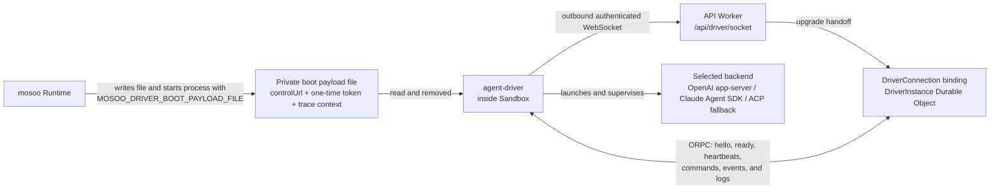

<div align="center">


<h1>mosoo-agent-driver</h1>

<strong>A runtime-neutral AI execution bridge for sandboxed coding agents.</strong>
<br />
One Agent Driver protocol for Claude Agent SDK, Codex app-server, and Agent Client Protocol (ACP).

<br />
<br />

[](https://github.com/langgenius/mosoo-agent-driver/actions/workflows/pr.yml)
[](https://www.npmjs.com/package/@mosoo/agent-driver)
[](https://www.npmjs.com/package/@mosoo/agent-driver)
[](./LICENSE.txt)

[](https://github.com/langgenius)
[](https://x.com/mosooagent)

</div>

---

`mosoo-agent-driver` is the repository for the `@mosoo/agent-driver` package: a standalone Agent Driver and AI execution bridge for sandbox-hosted coding agent sessions.
It runs inside the sandbox and drives one session from boot to stop.
The core product is the **Driver Kernel**: runtime-neutral commands, events, host ports, provider backends, and the provider registry.

An experimental, unsupported Anthropic Managed Agents (CMA)-shaped library adapter is layered on top of the Driver Kernel through projections. It is not a compatibility or conformance claim, and it is not part of mosoo's production API. Provider backends emit Driver runtime events and consume Driver commands; they do not emit CMA events directly.

## Current mosoo topology



The Driver does not open a sandbox-local control listener. In mosoo's production path, Runtime writes the private boot payload, passes its path in `MOSOO_DRIVER_BOOT_PAYLOAD_FILE`, and starts `agent-driver`; boot configuration is not injected through standard input. The Driver reads and removes the file, converts the payload's `controlUrl` to `ws:` or `wss:`, and actively dials `/api/driver/socket`. The API Worker routes the upgrade to the `DriverConnection` binding backed by the matching `DriverInstance` Durable Object. That object validates and claims the one-time boot token and owns the ORPC command, readiness, heartbeat, event, and log lifecycle.

## AI Execution Bridge Architecture

Different model vendors ship different agent runtimes — the Claude Agent SDK, OpenAI's app-server protocol, and ACP-based agents — and each speaks its own event vocabulary. `@mosoo/agent-driver` unifies them at the kernel level so the host integrates **one** protocol instead of three.

- **Kernel-level unification.** Three launchable transports — `openai-app-server` (OpenAI runtime), `claude-agent-sdk`, and `acp-fallback` — project onto a single Driver event protocol. The host writes against one set of commands and events regardless of which backend is behind the session. The container currently configures OpenCode as the default ACP process, while the ACP command remains configurable.
- **Runtime-neutral by design.** The Driver Kernel owns command dispatch, runtime event emission, provider lifecycle, the permission flow, and diagnostics. Hosts own credentials, files, skills, MCP, policy, logging, persistence, and transport through well-defined host ports. The library is safe to import and never starts the process runner on its own.
- **Experimental Managed Agents-shaped adapter.** The library exports an HTTP handler, thin client, projections, and in-memory store for a subset of Anthropic Managed Agents (CMA)-shaped routes and events. This preview is unsupported: it has no compatibility, conformance, completeness, or stability guarantee, and mosoo does not mount it as a production API.
- **Typed public entries.** Every public entry ships a matching declaration file under `dist/types`, and the package carries **no** `@mosoo/*` runtime dependencies — it is self-contained and portable.

## Package Entries

- Command `agent-driver`: Bun process runner, built to `dist/driver.mjs`; in mosoo it consumes the private boot payload and dials the API control socket.
- Package root `@mosoo/agent-driver`: Driver Kernel, provider registry, host ports, commands, events, diagnostics, the in-memory CMA store, and CMA projection exports.
- `@mosoo/agent-driver/boot`: process boot payload, protocol version, boot environment names, and host snapshot contracts.
- `@mosoo/agent-driver/runtime`: runtime-neutral runtime, transport, and native resume contracts.
- `@mosoo/agent-driver/paths`: sandbox path constants and path normalization helpers shared by host integrations.
- `@mosoo/agent-driver/events`: canonical driver event envelope contracts.
- `@mosoo/agent-driver/contract`: vendor-neutral Authority, Preview, control, synchronization, and JSON-RPC contracts.
- `@mosoo/agent-driver/orpc`: Driver-to-`DriverInstance` ORPC wire input/output contracts.
- `@mosoo/agent-driver/cma-http`: experimental, unsupported CMA-shaped HTTP handler.
- `@mosoo/agent-driver/cma-sdk`: experimental, unsupported CMA-shaped client.

## Runtime Contract

The Contract is the vendor-neutral state and control boundary between the host and provider executors.

- **Stable model.** A `Session` owns ordered `Run` work, each Run owns observable `Item` values, and `Interaction` represents input required from outside the executor.
- **Authority and Preview.** Authority is the only durable truth and advances through atomic full-entity mutations, while Preview is a bounded best-effort overlay for streaming content that may be merged or dropped and is always repairable from Authority.
- **Single writer.** The host coordinator serializes authoritative state, lifecycle timestamps, user facts, and interaction resolution, while executors propose updates under fenced leases and retry with stable mutation or command IDs.
- **Monotonic lifecycle.** Session, Run, Item, and Interaction follow small one-way state machines, terminal state never reopens, and display state is derived instead of persisted.
- **Bounded recovery.** Queues, payloads, leases, waits, and cleanup work have hard limits, durable state survives coordinator restart or hibernation, and failed cleanup remains owned for idempotent retry.
- **Closed core.** Unknown control values are rejected, while named capabilities, provenance, and namespaced extensions carry provider-specific behavior without weakening core invariants.

Contract-owned IDs use ULIDs, and internal absolute timestamps use timezone-qualified ISO 8601 strings with UTC as the default.

## Quick Start

`@mosoo/agent-driver` targets [Bun](https://bun.sh), with [Vite+](https://viteplus.dev) as the development toolchain and command entry point.
Vite+ provisions the Bun version declared by `packageManager`; Bun remains the runtime, package manager, test runner, and binary bundler underneath it.
Install the package in a Bun project:

```sh
bun add @mosoo/agent-driver
```

The smallest library example wires the experimental CMA-shaped HTTP handler to the in-memory store and talks to it with the bundled client — no network socket required. Drop the following into `quickstart.test.ts` and run `bun test quickstart.test.ts`:

```ts
import { expect, test } from "bun:test";

import { createCmaMemoryStore } from "@mosoo/agent-driver";
import { createCmaHttpHandler } from "@mosoo/agent-driver/cma-http";
import { CmaSdkClient } from "@mosoo/agent-driver/cma-sdk";

test("create an agent, environment, and session over the CMA surface", async () => {
  // 1. An in-memory store stands in for the host's persistence port.
  const store = createCmaMemoryStore();

  // 2. The CMA-shaped HTTP handler turns supported preview requests into Driver
  //    commands. dispatchDriverCommand is where a real host hands the
  //    command to a sandbox-hosted Driver Kernel.
  const handler = createCmaHttpHandler({
    store,
    dispatchDriverCommand: async () => undefined,
  });

  // 3. The client talks to the handler directly through fetch — point
  //    baseUrl at a server that explicitly embeds this preview. The default beta header
  //    (anthropic-beta: managed-agents-2026-04-01) is sent automatically.
  const client = new CmaSdkClient({
    baseUrl: "https://driver.local",
    fetch: async (input, init) => handler(new Request(input, init)),
  });

  const environment = await client.createEnvironment({ id: "env-1", name: "Main" });
  const agent = await client.createAgent({ id: "agent-1", name: "Reviewer" });
  const session = await client.createSession({
    id: "session-1",
    agentId: agent.id,
    environmentId: environment.id,
  });

  expect(session).toMatchObject({ id: "session-1", agentId: "agent-1" });
});
```

This exercises the implemented `/v1/environments`, `/v1/agents`, and `/v1/sessions` preview routes. It does not establish CMA compatibility, and mosoo does not mount this handler. An embedding application must supply its own authorization, durable store, network server, and Driver command dispatcher.

### How it is used in mosoo

`@mosoo/agent-driver` is the **runtime kernel of the mosoo agent runtime**. When mosoo starts an agent session, it writes the private boot payload, boots this driver inside a sandbox, and waits on the matching `DriverInstance` Durable Object. The Driver dials outward, selects a provider backend from the registry, drives the session, and sends its runtime-neutral Driver protocol over ORPC. The host supplies credentials, files, skills, MCP, policy, and persistence through host ports.

[mosoo](https://github.com/langgenius/mosoo) and this Driver repository are public. mosoo exposes its production client contract through the [Public Thread API](https://github.com/langgenius/mosoo/blob/main/docs/prd/public-thread-api-surface.md) under `/api/v1`, not through the experimental CMA-shaped adapter. The reusable Driver library and CLI are distributed as `@mosoo/agent-driver` on npmjs.

## Commands

```sh
vp install --frozen-lockfile
vp run fmt
vp run lint
vp run tc
vp run test
vp run build
vp run build:image
vp run check
vp run clean
```

`vp run build:image` uses Buildah to produce a local linux/amd64 `agent-driver:local` OCI image and installs `dist/driver.mjs` on the image `PATH` as `agent-driver`.

The image contract in `environment-package-managers.json` exposes `npm` and `pip` to Mosoo Environment writes. The image build verifies that each tool is executable, reports a valid version, and resolves through coherent Python/pip aliases. `vp run test:image:environment` installs and executes one pinned package through each manager using the same isolated-prefix mode as Mosoo Environment artifacts.

## Boundaries

- The Driver Kernel owns command dispatch, runtime event emission, provider lifecycle, permission flow, diagnostics, and host port contracts.
- Host applications own credential, file, skill, MCP, policy, logging, persistence, and transport implementations.
- Provider backends depend on Driver contracts and host ports only.
- The library root is safe to import and must not start the process runner.
- The package must not depend on mosoo workspace packages at runtime.
- mosoo control traffic uses the outbound ORPC WebSocket to `DriverInstance`; the Driver does not expose a sandbox-local control listener.
- The CMA-shaped exports are an experimental library adapter, not a mosoo production endpoint or a compatibility guarantee.

## Checks

- `vp run check`
- `vp run build:image`
- `vp run test:image:environment`
- no `@mosoo/*` runtime dependencies in `package.json`
- public entries include typed exports
- live artifact tests are gated by environment credentials

## Artifact Live Tests

Every live test launches `dist/driver.mjs` as a child process and talks to it only through the production boot payload and control protocol.

The default matrix exercises all three runtime integrations through OpenRouter and does not claim separate certification of each provider's first-party endpoint.

The test controller implements the production wire contract locally, so CMA, Durable Object persistence, database recovery, and deployment networking remain system-test responsibilities.

The compatibility tier validates context continuity, canonical event lifecycles, workspace operations, and command-failure recovery against every configured model.

The lifecycle tier runs native resume, active-turn crash resume, stale resume, start-boundary and active cancellation with replay, permission cancellation/rejection/approval, active stop, `SIGTERM`, active control disconnection, and active heartbeat failure against one representative model per runtime.

Delayed filesystem markers plus shell and worker PIDs prove that cancellation and shutdown stop the supervised real tool tree before reporting completion.

Linux crash supervision requires readable `/proc` and covers same-UID descendants that retain the private supervision environment; it is not a security or isolation boundary.

Environment-clearing or UID-changing descendants require sandbox or container teardown as the authoritative cleanup layer.

The control tier runs the runtime-neutral changed-command replay failure once.

A provider-free packed-artifact test uses a local Streamable HTTP MCP server to cover authenticated setup, argument rejection, text and structured results, failure recovery, cancellation, and replay idempotency.

One representative model per runtime also calls an authenticated local MCP marker tool through its native provider configuration path.

Live startup pins and verifies the project-local OpenAI app-server and OpenCode executable versions before making network calls.

Protocol-only races such as ACP load replay barriers, burst updates, and event-delivery backpressure remain in deterministic tests.

- `vp run test:live` builds the artifact and runs the complete matrix.
- `vp run test:live:openai` runs the OpenAI runtime slice.
- `vp run test:live:anthropic` runs the Anthropic runtime slice.
- `vp run test:live:opencode` runs all configured OpenCode compatibility models plus one representative lifecycle model.
- `vp run test:live:artifact` tests the artifact path supplied by `AGENT_DRIVER_LIVE_ARTIFACT` without rebuilding it.

The release workflow extracts the packed NPM archive to `packed/` and blocks image and package publication unless `packed/dist/driver.mjs` passes the provider-free MCP artifact test.

## License

Licensed under the [Apache License 2.0](./LICENSE.txt).
