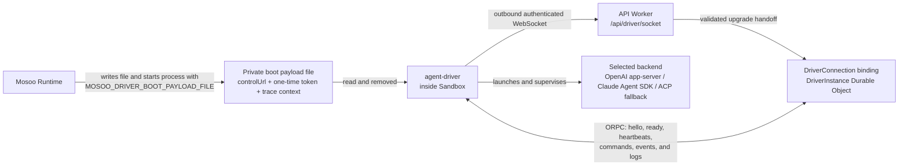

<div align="center">


<h1>mosoo-agent-driver</h1>

<strong>One Driver Kernel. Multiple agent backends.</strong>
<br />
The Mosoo Agent Driver — the runtime that drives a sandbox-hosted agent session inside Mosoo.

<br />
<br />

<!-- Static badges below render cleanly before the package is published to npm.
     Once the first npm release exists, swap in the dynamic versions:
     build:     https://img.shields.io/github/actions/workflow/status/langgenius/mosoo-agent-driver/ci.yml?branch=main&label=build
     version:   https://img.shields.io/npm/v/agent-driver?label=version
     downloads: https://img.shields.io/npm/dm/agent-driver?label=downloads -->

[](#checks)
[](./package.json)
[](./LICENSE.txt)

[](https://github.com/langgenius)
[](https://x.com/mosooagent)

</div>

---

`mosoo-agent-driver` is the standalone runtime driver for sandbox-hosted agent sessions. It runs inside the sandbox and drives a single agent session from boot to stop. The core product is the **Driver Kernel**: runtime-neutral commands, events, host ports, provider backends, and the provider registry. The package manifest uses the name `agent-driver`, but the package has not been published to npm yet.

An experimental, unsupported CMA-shaped library adapter is layered on top of the Driver Kernel through projections. It is not a compatibility or conformance claim, and it is not part of Mosoo's production API. Provider backends emit Driver runtime events and consume Driver commands; they do not emit CMA events directly.

## Current Mosoo topology



The Driver does not open a sandbox-local control listener. In Mosoo's production path, Runtime writes the private boot payload, passes its path in `MOSOO_DRIVER_BOOT_PAYLOAD_FILE`, and starts `agent-driver`; boot configuration is not injected through standard input. The Driver reads and removes the file, converts the payload's `controlUrl` to `ws:` or `wss:`, and actively dials `/api/driver/socket`. The API Worker validates the upgrade and hands it to the `DriverConnection` binding backed by the matching `DriverInstance` Durable Object. That object owns the ORPC command, readiness, heartbeat, event, and log lifecycle.

## Why agent-driver

Different model vendors ship different agent runtimes — the Claude Agent SDK, OpenAI's app-server protocol, and ACP-based agents — and each speaks its own event vocabulary. `agent-driver` unifies them at the kernel level so the host integrates **one** protocol instead of three.

- **Kernel-level unification.** Three launchable transports — `openai-app-server` (OpenAI runtime), `claude-agent-sdk`, and `acp-fallback` — project onto a single Driver event protocol. The host writes against one set of commands and events regardless of which backend is behind the session. The container currently configures OpenCode as the default ACP process, while the ACP command remains configurable.
- **Runtime-neutral by design.** The Driver Kernel owns command dispatch, runtime event emission, provider lifecycle, the permission flow, and diagnostics. Hosts own credentials, files, skills, MCP, policy, logging, persistence, and transport through well-defined host ports. The library is safe to import and never starts the process runner on its own.
- **Experimental CMA-shaped adapter.** The library exports an HTTP handler, thin client, projections, and in-memory store for a subset of CMA-shaped routes and events. This preview is unsupported: it has no compatibility, conformance, completeness, or stability guarantee, and Mosoo does not mount it as a production API.
- **Typed public entries.** Every public entry ships a matching declaration file under `dist/types`, and the package carries **no** `@mosoo/*` runtime dependencies — it is self-contained and portable.

## Package Entries

- Command `agent-driver`: Bun process runner, built to `dist/driver.mjs`; in Mosoo it consumes the private boot payload and dials the API control socket.
- Package root `agent-driver`: Driver Kernel, provider registry, host ports, commands, events, diagnostics, the in-memory CMA store, and CMA projection exports.
- `agent-driver/boot`: process boot payload, protocol version, boot environment names, and host snapshot contracts.
- `agent-driver/runtime`: runtime-neutral runtime, transport, and native resume contracts.
- `agent-driver/paths`: sandbox path constants and path normalization helpers shared by host integrations.
- `agent-driver/events`: canonical driver event envelope contracts.
- `agent-driver/orpc`: Driver-to-`DriverInstance` ORPC wire input/output contracts.
- `agent-driver/cma-http`: experimental, unsupported CMA-shaped HTTP handler.
- `agent-driver/cma-sdk`: experimental, unsupported CMA-shaped client.

Every public entry has a matching declaration file under `dist/types`.

## Quick Start

`agent-driver` targets [Bun](https://bun.sh). It is not currently available from npm; work from this repository checkout, install dependencies, and run the test suite:

```sh
bun install
bun test
```

The smallest library example wires the experimental CMA-shaped HTTP handler to the in-memory store and talks to it with the bundled client — no network socket required. Drop the following into `tests/quickstart.test.ts` and run `bun test tests/quickstart.test.ts`:

```ts
import { expect, test } from "bun:test";

import { createCmaMemoryStore } from "agent-driver";
import { createCmaHttpHandler } from "agent-driver/cma-http";
import { createCmaSdkClient } from "agent-driver/cma-sdk";

test("create an agent, environment, and session over the CMA surface", async () => {
  // 1. An in-memory store stands in for the host's persistence port.
  const store = createCmaMemoryStore();

  // 2. The CMA-shaped HTTP handler turns supported preview requests into Driver
  //    commands. dispatchDriverCommand is where a real host hands the
  //    command to a sandbox-hosted Driver Kernel.
  const handler = createCmaHttpHandler({
    store,
    dispatchDriverCommand: async () => undefined,
  });

  // 3. The client talks to the handler directly through fetch — point
  //    baseUrl at a server that explicitly embeds this preview. The default beta header
  //    (anthropic-beta: managed-agents-2026-04-01) is sent automatically.
  const client = createCmaSdkClient({
    baseUrl: "https://driver.local",
    fetch: async (input, init) => handler(new Request(input, init)),
  });

  const environment = await client.createEnvironment({ id: "env-1", name: "Main" });
  const agent = await client.createAgent({ id: "agent-1", name: "Reviewer" });
  const session = await client.createSession({
    id: "session-1",
    agentId: agent.id,
    environmentId: environment.id,
  });

  expect(session).toMatchObject({ id: "session-1", agentId: "agent-1" });
});
```

This exercises the implemented `/v1/environments`, `/v1/agents`, and `/v1/sessions` preview routes. It does not establish CMA compatibility, and Mosoo does not mount this handler. An embedding application must supply its own authorization, durable store, network server, and Driver command dispatcher.

### How it is used in Mosoo

`agent-driver` is the **runtime kernel of the Mosoo agent runtime**. When Mosoo starts an agent session, it writes the private boot payload, boots this driver inside a sandbox, and waits on the matching `DriverInstance` Durable Object. The Driver dials outward, selects a provider backend from the registry, drives the session, and sends its runtime-neutral Driver protocol over ORPC. The host supplies credentials, files, skills, MCP, policy, and persistence through host ports.

[Mosoo](https://github.com/langgenius/mosoo) and this Driver repository are already public. Mosoo exposes its production client contract through the [Public Thread API](https://github.com/langgenius/mosoo/blob/main/docs/prd/public-thread-api-surface.md) under `/api/v1`, not through the experimental CMA-shaped adapter. The `agent-driver` npm package has not been published yet.

## Commands

```sh
bun install
bun run lint
bun run tc
bun run test
bun run build
bun run docker:build
```

`bun run docker:build` produces a local `agent-driver:local` image and installs `dist/driver.mjs` on the image `PATH` as `agent-driver`.

## Boundaries

- The Driver Kernel owns command dispatch, runtime event emission, provider lifecycle, permission flow, diagnostics, and host port contracts.
- Host applications own credential, file, skill, MCP, policy, logging, persistence, and transport implementations.
- Provider backends depend on Driver contracts and host ports only.
- The library root is safe to import and must not start the process runner.
- The package must not depend on Mosoo workspace packages at runtime.
- Mosoo control traffic uses the outbound ORPC WebSocket to `DriverInstance`; the Driver does not expose a sandbox-local control listener.
- The CMA-shaped exports are an experimental library adapter, not a Mosoo production endpoint or a compatibility guarantee.

## Checks

- `bun run lint`
- `bun run tc`
- `bun run test`
- `bun run build`
- `bun run docker:build`
- no `@mosoo/*` runtime dependencies in `package.json`
- public entries include typed exports
- live provider smoke tests are gated by environment credentials

## License

Licensed under the [Apache License 2.0](./LICENSE.txt).
