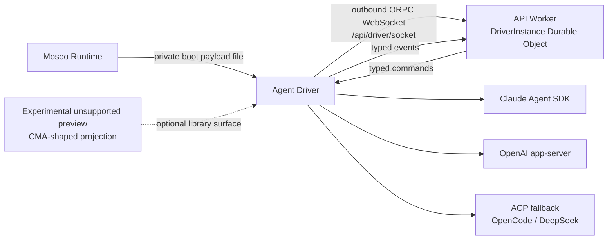

<div align="center">


<h1>mosoo-agent-driver</h1>

<strong>One Driver Kernel. Multiple agent backends.</strong>
<br />
The Mosoo Agent Driver — the runtime that drives a sandbox-hosted agent session inside Mosoo.

<br />
<br />

<!-- The CI badge is live now. Once agent-driver is published to npm, add the
     dynamic npm badges:
     version:   https://img.shields.io/npm/v/agent-driver?label=version
     downloads: https://img.shields.io/npm/dm/agent-driver?label=downloads -->

[](https://github.com/langgenius/mosoo-agent-driver/actions/workflows/ci.yml)
[](./package.json)
[](./LICENSE.txt)
[](https://github.com/langgenius)
[](https://x.com/mosooagent)

</div>

---

`mosoo-agent-driver` (workspace/package name `agent-driver`) is the standalone
runtime driver for sandbox-hosted agent sessions. The npm package is not
published yet. It runs inside the sandbox and drives a single agent session from
boot to stop. The core product is the **Driver Kernel**: runtime-neutral commands,
events, host ports, provider backends, and the provider registry.

An experimental, unsupported CMA-shaped HTTP preview is layered on top of the
Driver Kernel. Its explicitly experimental package entry is available from the
source repository and locally packed tarballs, but no npm release exists yet. It
is not an official Managed Agents implementation and carries no wire-compatibility
or semantic-version stability guarantee. Provider backends emit Driver runtime
events and consume Driver commands; they do not emit projection events directly.



## Why agent-driver

Different model vendors ship different agent runtimes — the Claude Agent SDK, OpenAI's app-server protocol, and ACP-based agents — and each speaks its own event vocabulary. `agent-driver` unifies them at the kernel level so the host integrates **one** protocol instead of three.

- **Kernel-level unification.** Three backends — `claude-agent-sdk`, `openai-app-server` (OpenAI runtime), and `acp-fallback` — all project onto a single Driver event protocol. The host writes against one set of commands and events regardless of which vendor is behind the session.
- **Runtime-neutral by design.** The Driver Kernel owns command dispatch,
  runtime event emission, provider lifecycle, the permission flow, and
  diagnostics. Its host ports cover commands/events, permissions, MCP, Skills,
  file-change reporting, and host snapshots. The host resolves credentials into
  the frozen execution input and supplies logging/transport integration outside
  that port set. The library is safe to import and never starts the process
  runner on its own.
- **Experimental unsupported preview.** Includes CMA-shaped `/v1/agents`,
  `/v1/environments`, and `/v1/sessions` routes, a bundled client, and an
  in-memory store for evaluation. These live under one explicit
  `experimental/cma` package entry; the beta-header-shaped gate and route names
  do not establish compatibility with Anthropic's official API or SDK.
  Unsupported fields and breaking preview changes are expected.
- **Typed public entries.** Every public entry ships a matching declaration file under `dist/types`, and the package carries **no** `@mosoo/*` runtime dependencies. It is standalone and Bun-targeted.

## Package Entries

- Command `agent-driver`: Bun process runner, built to `dist/driver.mjs`.
- Package root `agent-driver`: Driver Kernel, provider registry, host ports,
  commands, events, and diagnostics. It deliberately excludes preview helpers.
- `agent-driver/boot`: process boot payload, protocol version, boot environment names, and host snapshot contracts.
- `agent-driver/runtime`: runtime-neutral runtime, transport, provider capability, and native resume contracts.
- `agent-driver/paths`: sandbox path constants and path normalization helpers shared by host integrations.
- `agent-driver/events`: canonical driver event envelope contracts.
- `agent-driver/orpc`: Driver control WebSocket RPC wire input/output contracts.
- `agent-driver/experimental/cma`: the unsupported CMA-shaped projection,
  in-memory store, HTTP handler, and client. The `experimental` path is an
  instability marker, not an official compatibility claim.

Every public entry has a matching declaration file under `dist/types`.

## Quick Start

`agent-driver` targets [Bun](https://bun.sh). Install dependencies and run the test suite:

```sh
bun install
bun test
```

The smallest projection example wires the experimental preview HTTP handler to the
in-memory store and talks to it with the bundled client — no network socket
required. This demonstrates the optional library surface, not Mosoo's production
control path or official Managed Agents compatibility. Drop the following into
`tests/quickstart.test.ts` and run `bun test tests/quickstart.test.ts`:

```ts
import { expect, test } from "bun:test";

import {
  createCmaHttpHandler,
  createCmaMemoryStore,
  createCmaSdkClient,
} from "agent-driver/experimental/cma";

test("create an agent, environment, and session over the preview projection", async () => {
  // 1. The preview handler receives its projection store directly.
  const store = createCmaMemoryStore();

  // 2. The private HTTP handler turns projection requests into Driver
  //    commands. dispatchDriverCommand is where a host could hand the
  //    command to a sandbox-hosted Driver Kernel.
  const handler = createCmaHttpHandler({
    store,
    dispatchDriverCommand: async () => undefined,
  });

  // 3. The client talks to the handler directly through fetch — point
  //    baseUrl at a server hosting this preview projection. Its
  //    beta-header-shaped gate is sent automatically.
  const client = createCmaSdkClient({
    baseUrl: "https://driver.local",
    fetch: async (input, init) => handler(new Request(input, init)),
  });

  const environment = await client.createEnvironment({ id: "env-1", name: "Main" });
  const agent = await client.createAgent({ id: "agent-1", name: "Reviewer" });
  const session = await client.createSession({
    id: "session-1",
    agentId: agent.id,
    environmentId: environment.id,
  });

  expect(session).toMatchObject({ id: "session-1", agentId: "agent-1" });
});
```

This exercises the preview projection's `/v1/environments`, `/v1/agents`, and
`/v1/sessions` routes. Do not point an official Managed Agents SDK at it or treat
this example as Mosoo's production integration path or a stable API contract.

### How it is used in Mosoo

`agent-driver` is the **runtime kernel of the Mosoo agent runtime**. Mosoo writes a
private boot payload file and starts the driver inside a sandbox with
`MOSOO_DRIVER_BOOT_PAYLOAD_FILE`. The driver reads and removes that payload,
selects a provider backend, and opens an outbound connection to
`/api/driver/socket`. The Worker upgrades the connection and routes typed
commands and events through the `DriverConnection` Durable Object, backed by the
`DriverInstance` implementation. The public client surface is Mosoo's Public
Thread API, not the experimental CMA-shaped preview.

The full [Mosoo](https://github.com/langgenius/mosoo) alpha is already public and
open source. This driver is the runtime kernel used by that repository.

## Commands

```sh
bun install
bun run fmt:check
bun run lint
bun run tc
bun run test
bun run build
bun run test:package
bun run docker:build
```

`bun run docker:build` produces a local `agent-driver:local` image for
`linux/amd64` and installs `dist/driver.mjs` on the image `PATH` as
`agent-driver`. Apple Silicon hosts run that image through Docker's amd64
emulation because the pinned Cloudflare Sandbox base image is amd64-only.

`bun run test:package` requires `npm` and `tar` on `PATH`; it packs, installs,
imports, type-checks, and executes the local tarball without publishing it.

## Boundaries

- The Driver Kernel owns command dispatch, runtime event emission, provider lifecycle, permission flow, diagnostics, and host port contracts.
- Driver host ports cover command/event transport, permission decisions, MCP
  execution, Skill materialization, file-change reporting, and the host
  integration snapshot.
- Host applications resolve credentials and configuration into the frozen
  execution input. They also own durable persistence outside the kernel, while
  logging is supplied through the kernel/runtime context rather than a
  persistence or credential host port.
- Provider backends depend on Driver contracts and host ports only.
- The library root is safe to import and must not start the process runner.
- The package must not depend on Mosoo workspace packages at runtime.
- Protocol v1 still carries a required `driverControlPort` compatibility field
  used only by legacy diagnostics. The Driver never binds or listens on that
  port; removing the field requires a versioned API/Driver rollout.

## Checks

- `bun run lint`
- `bun run fmt:check`
- `bun run tc`
- `bun run test`
- `bun run build`
- `bun run test:package`
- `bun run docker:build`
- no `@mosoo/*` runtime dependencies in `package.json`
- public entries include typed exports
- live provider smoke tests are gated by environment credentials

## License

Licensed under the [Apache License 2.0](./LICENSE.txt).
